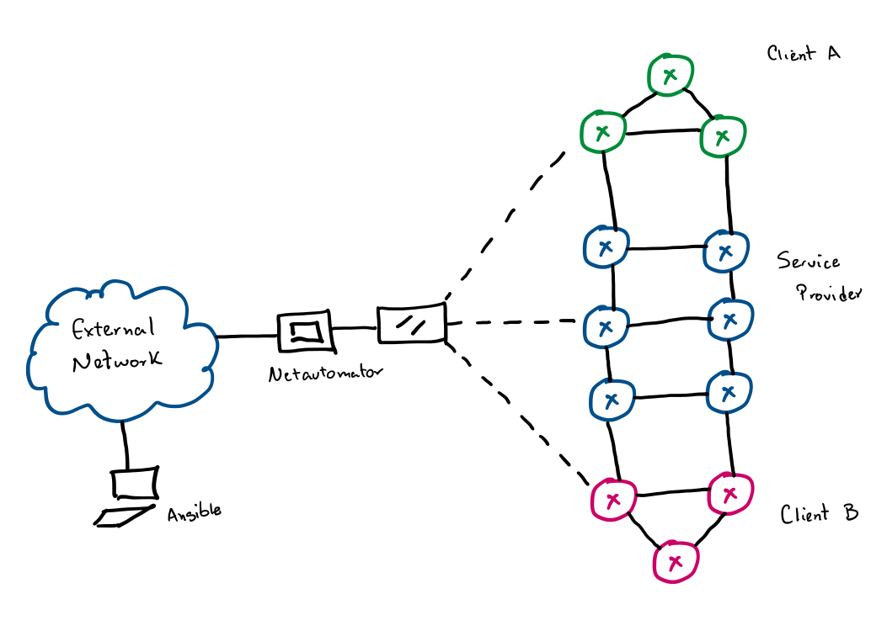

# MPLS Lab Example

This project aims to completely run an automated MPLS L3 VPN lab in GNS3 with the help of this [GNS3 ansible collection](https://galaxy.ansible.com/davidban77/gns3).

## Topology

Consists of 2 clients (`client_a` and `client_b`) and a Service Provider network (`service_provider`).



Devices management interfaces are connected to a **netautomator** host, which in turn is connected to a cloud object to access the outside world.

## Considerations

The topology of the lab is dependent on a management container (**netautomator**) inside the GNS3 topology that has access to the external world through a **cloud** object. This means that playbooks of `activate` and `setup` of **netautomator** are dependant of it.

To make sure that you can replicate this lab in your own setup, there are some **environment variables** that need to be set:

```shell
export NETAUTOMATOR_PREFIX=<container IP address to the cloud/IP prefix>
export NETAUTOMATOR_DNS=<DNS IP address>
export NETAUTOMATOR_USR=<container user>
export NETAUTOMATOR_PWD=<container password>
export NETAUTOMATOR_NEIGH_1=<an IP neighbor to ping>
export NETAUTOMATOR_NEIGH_2=<an IP neighbor to ping>
export NET_DEVICE_USER=<network devices user>
export NET_DEVICE_PASSWORD=<network devices password>
```

Normally you will create a `.env` file with this parameters set and run:

```shell
cd mpls-lab/
source .env
```

## Requirements

- Python 3.6 or above
- [Ansible collection for gns3](https://galaxy.ansible.com/davidban77/gns3)

And some python packages:

- `netaddr`
- `pexpect`
- `gns3fy`

## Lab Setup

The main playbook is named `lab.yml` and is on the base directory of this project. It has two ways to be executed: `create` and setup the lab, or `delete` the lab.

**NOTE:** You have be under the `mpls-lab` directory

```shell
ansible-playbook lab.yml -e execute=create
```

This will run the following playbooks:

- `lab_setup.yml`: It will use the `gns3_vars.yml` variable file to create the topology, nodes and links of the lab. It will also generate and deploy the configuration to the netautomator container and initial configuration of the network devices.

- `activate_netautomator.yml`: This is dirty `expect` execution on the console to run some ping commands against some IPs so the netautomator refreshes its ARP cache and we can successfully connect to it with SSH over the cloud object. **NOTE:** This is needed on my environment, if this is not your case feel free to delete/comment the playbook.

- `setup_netautomator.yml`: This playbooks aims to setup/install packages in the **netautomator** container. For this case it installs the awesome [netmiko](https://github.com/ktbyers/netmiko) library to perform a connectivity test script (located in `scripts/conn_test_links.py`) thanks to [@krlosromero](https://twitter.com/krlosromero) contribution!.

- `network_devices_test.yml`: Finally it connects to each network device and collects the output of `show version` command to verify that ansible can connect to it. For this it uses the **netautomator** container as jump host and the settings can be seen in the `ansible.cfg` file and `ansible_ssh_common_args` variable in the `inventory/group_vars/network.yml`.

This complete run will ensure the following:

- The creation of the `mpls_lab` topology along side the 12 Cisco IOSv routers and the netautomator container.
- Initial bootstrap configuration for all the routers with the interfaces IP and description, `netops` user with password and SSH basic login.
- Interfaces configuration for netautomator container with access to the outside world. Also installation of required packages to run network automation tasks.
- Network device tests to verify end-to-end management connectivity.

## Lab Deletion

The following option destroys and deletes the lab.

```shell
ansible-playbook lab.yml -e execute=delete
```
